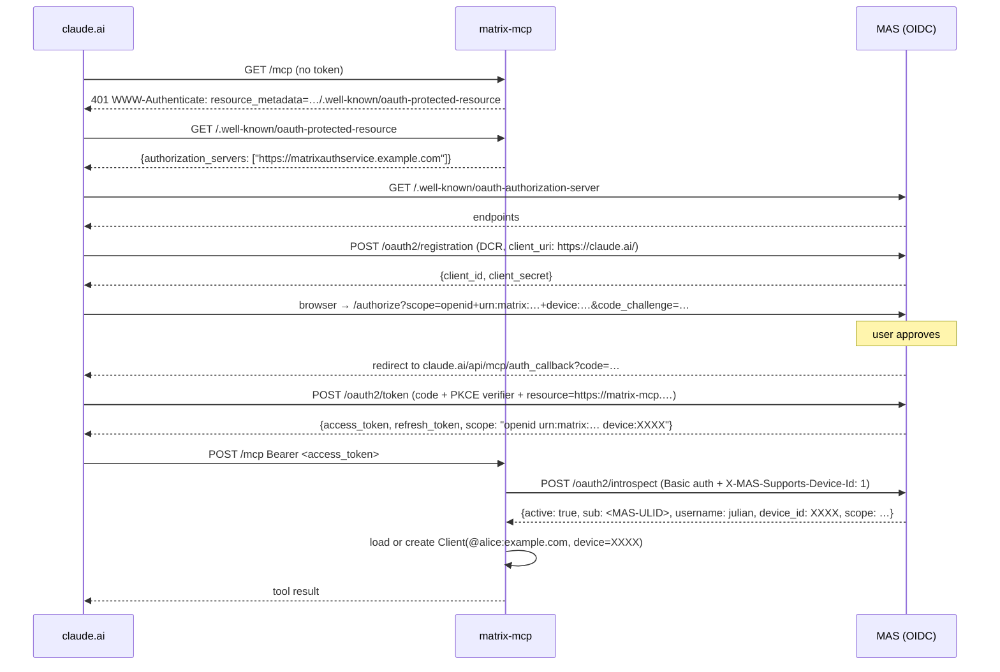
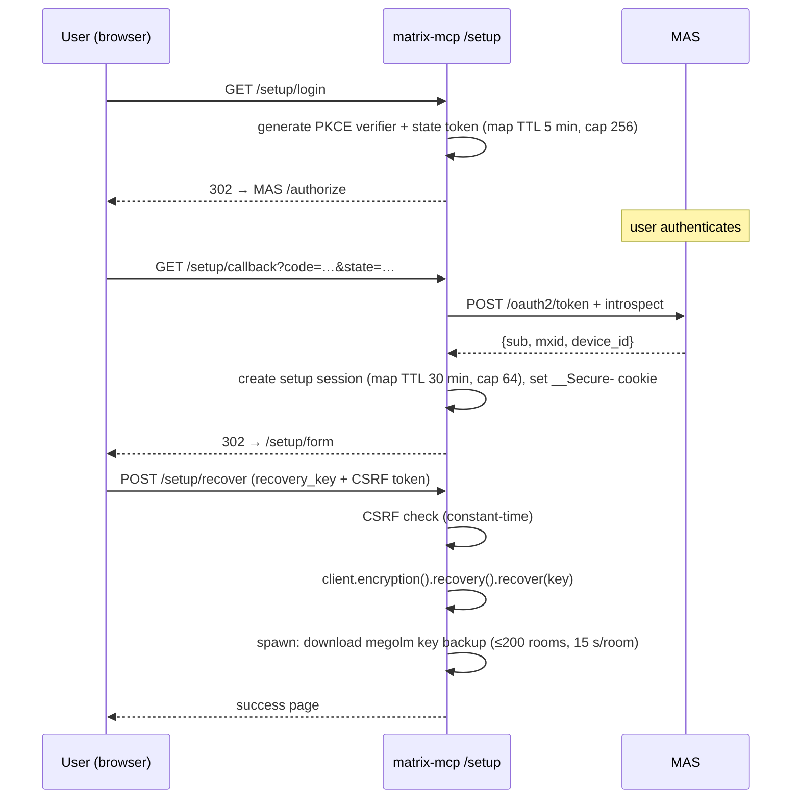
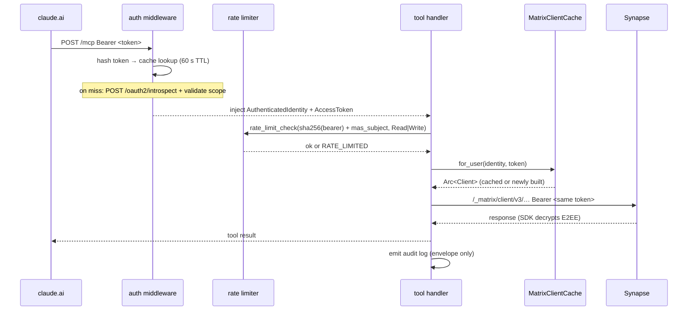

# Architecture

Last updated: 2026-05-15, v0.1.0.

## Overview

matrix-mcp is a slim adapter between claude.ai (MCP client) and a
Matrix homeserver. It is an OAuth 2.1 resource server on one side and
a Matrix client on the other. There is no token exchange – the bearer
token claude.ai presents is the same token forwarded to Synapse.

```
claude.ai ──HTTPS/MCP── [Traefik IP-allowlist] ──► matrix-mcp ──► MAS (introspection)
                                                         │
                                                         └──────────► Synapse (Matrix C-S API)
```

Traefik restricts `/mcp` to Anthropic's published egress range
(`160.79.104.0/21`) before the request reaches the process.

---

## OAuth dance (first connection)



Key points:

- MAS's `authorization_endpoint` is at `/authorize`, not `/oauth2/authorize`
  – an exception to its `/oauth2/*` convention.
- Introspection response is cached for min(60 s, token TTL). Cache
  invalidates on a 401 from Synapse downstream.
- Tokens without an `aud` claim are accepted (claude.ai omits `resource=`),
  but must carry a Matrix C-S API scope token as a compensating control.

---

## /setup flow (E2EE unlock)

The `/setup` flow takes the recovery key via browser HTTPS so it never
appears in claude.ai's chat history.



`verify_status` reports `cross_signed: true` within ~30 s after success.

---

## MCP request lifecycle



---

## Sync loop

Each `matrix_sdk::Client` runs a background sync task after construction.
The Phase 6.3 watchdog wraps it with exponential backoff.

```
MatrixClientCache::for_user()
  └── build Client (SqliteStateStore + SqliteCryptoStore, HKDF passphrase)
  └── restore_session(MatrixSession)
  └── spawn tokio task:
        loop {
          sync_once().await
            → ok  : reset backoff
            → err : exponential backoff, warn log
        }
```

The sync task is aborted via `JoinHandle::abort()` when `CachedClient` drops.

---

## Per-user state model

| Concept | Value |
|---|---|
| Cache key | `sha256(mas_subject + device_id)[..32]` |
| Store dir | `{STORE_DIR}/{cache_key}/` |
| Store cipher passphrase | `HKDF-SHA256(salt=cache_key, ikm=pepper, info="matrix-mcp-store-cipher v1", len=32) → hex` |
| Sync task | `JoinHandle<()>`, aborted on eviction |

### Store files

```
{STORE_DIR}/
  {cache_key}/
    matrix-sdk-state.sqlite3    — room state, timelines, members
    matrix-sdk-crypto.sqlite3   — Olm/Megolm sessions, cross-signing keys
```

Both files are encrypted by matrix-sdk's `StoreCipher`. The pepper
lives exclusively in the pod environment (Kubernetes Secret from
1Password) and is never written to disk.

---

## HTTP endpoints

| Path | Auth | Purpose |
|---|---|---|
| `GET /health` | none | Liveness / readiness probe |
| `GET /.well-known/oauth-protected-resource` | none | RFC 9728 resource metadata |
| `POST /mcp` | Bearer (MAS) | MCP Streamable HTTP transport |
| `GET /setup` | none | Landing page |
| `GET /setup/login` | none | Initiates PKCE flow |
| `GET /setup/callback` | PKCE state cookie | OAuth callback |
| `GET /setup/form` | Session cookie | Recovery key form |
| `POST /setup/recover` | Session cookie + CSRF | Import recovery key |
| `GET /metrics` | internal (pod IP:9090) | Prometheus metrics |
